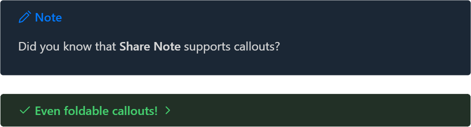

# Share Note

[System Status](https://status.note.sx/)

Instantly share / publish a note. Notes are shared with your full theme and should look identical to how they look in your Obsidian vault.

- 🆘 I need help! [Go here first for help and troubleshooting](https://docs.note.sx/)
- 👉 [Install this plugin from the Plugin Store](https://obsidian.md/plugins?id=share-note)
- 📄 [Documentation](https://docs.note.sx/)
- 💬 [Discussion for this plugin](https://forum.obsidian.md/t/42788)
- 🚀 [Request new features / see the roadmap](https://note.sx/roadmap)

To share a note, choose `Share Note` from the command palette, or click the `⋮` menu in any note and choose `Copy shared link`


---

## Full theme support

Uploads using your current theme, along with all your options and custom CSS snippets.

Supports all Obsidian content types:

### Images!


### Dataview queries!

Here's an example inline Dataview query. It will be correctly rendered when sharing:

```
The answer is `= 7 + 8`!
```

The answer is 15!

### Callouts!



### Links between notes!

If your shared note links to another note which is also shared, that link will also function on the shared webpage.

### Code blocks!

```javascript
function doYouEven(haveToAsk) {
  return 'Of course we can do it!'
}
```

### Checkboxes! Tags!

**Project Manhattan:** #in-progress #behind-schedule

- [x] Start project
- [x] Procrastinate
- [ ] Finish project

### Internal links

Share a table of contents and jump around your document.

---

## Usage

Use the `Share Note` command from the Command Palette. You can map it to a hotkey to make things faster.

The first time a file is shared, the plugin will automatically upload all your theme styles. The next time you share a file, it will use the previously uploaded theme files.

If you want to force the theme CSS to update, use the command `Force re-upload of all data for this note`.

---

## Encryption

The content of your note is encrypted by default. What this means is that you can read the note, and the person you send it to can read the note, but nobody else can read the content - not even the hosting server.

> 🛈 **Encryption is optional, and can be turned on/off for individual notes, or for all notes, whatever you prefer.**

> 🛈 Encryption applies to the note text content. It does not apply to attachments, which are stored unencrypted. Share Note is not a file sharing service, it's a **note* sharing service. If you want encrypted file sharing, it's not the right tool for you.

### 🧑‍💻 How it works 

When you share an encrypted note, you'll get a share link that looks like this:

https://share.note.sx/4earajc8#PtC3oQDjDQK9VP7fljmQkLBA/rIMb2tbFsGoG44VdFY

This part is the link to the file:

https://share.note.sx/4earajc8

If you click on it, you'll see a message that says "*Encrypted note*", because you haven't provided the decryption key.

The decryption key is the second part of the share link after the `#` symbol:

`#PtC3oQDjDQK9VP7fljmQkLBA/rIMb2tbFsGoG44VdFY`

When you combine those two things together, the note is able to be decrypted and you can see the content:

https://share.note.sx/4earajc8#PtC3oQDjDQK9VP7fljmQkLBA/rIMb2tbFsGoG44VdFY

The decryption key **only** exists inside your vault, and is only known to you and whoever you send the link to. Nobody else can read the content.

You may optionally share an unencrypted version of a note by using the frontmatter checkbox property `share_unencrypted` = ✅. This note you are currently reading is shared unencrypted.

If you decide you want to share most notes unencrypted by default, then you can encrypt an individual note by using a frontmatter checkbox called `share_encrypted`.

## Self-hosting

If you want to self-host your own server, you can use this docker image: https://github.com/note-sx/server

## Troubleshooting

See here: [Troubleshooting](https://docs.note.sx/troubleshooting)

### System status

https://status.note.sx/
