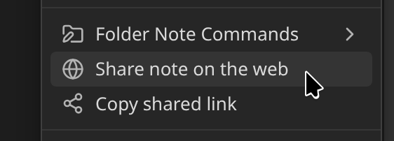

# Share Note plugin for Obsidian

Instantly share a note, with the full theme and content exactly like you see it in your Obsidian vault. Notes are [encrypted](./notes/encryption) by default, and only you and the person you send it to have the key.

- [👉 Get the plugin](https://obsidian.md/plugins?id=share-note)
- [💬 Obsidian forum thread](https://forum.obsidian.md/t/42788)
- [🚀 Request new features / see the roadmap](https://note.sx/roadmap)
- [🚥 System status](https://status.note.sx/)

## How to use

To share a note, run **Share current note** from the command palette, or open the `⋮` menu in any note and choose **Share note on the web**.

The first time, the plugin connects to the server and asks which kind of link you want. [Sharing your first note](./sharing-your-first-note) walks through what to expect.

If you're having any issues, check the [FAQ](./faq) or [🔧 Troubleshooting](./troubleshooting).

## Learn more

- [Settings](./settings) - every option explained
- [Encryption](./notes/encryption) - what it protects and how to turn it on or off per note
- [Theme](./notes/theme) - change how your shared notes look
- [Self-deleting notes](./notes/self-deleting-notes) - notes that expire
- [Letting readers import your note](./notes/importing-shared-notes) - a **Save note** button for readers with Obsidian
- [Managing your notes](./notes/managing-your-notes) - update, copy and delete shares, and list everything you've shared
- [Frontmatter properties](./notes/frontmatter-properties) - every `share_*` property in one place
