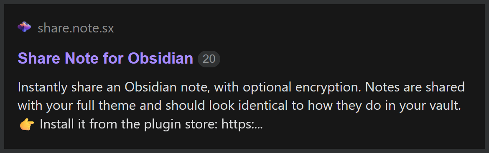

# {{ page.title }}

The content of your note is encrypted by default. What this means is that you can read the note, and the person you send it to can read the note, but nobody else can read the content - not even the hosting server.

Encryption is optional, and can be turned on/off for individual notes, or for all notes, whatever you prefer.

## How does the encryption work?

When you share an encrypted note, you'll get a share link that looks like this:

```
https://share.note.sx/xldtzcxq#Ty9bCAhVlSvC9f2FOxs...
```

This part is the link to the file:

https://share.note.sx/xldtzcxq

If you click on it, you'll see a message that says "*Encrypted note*", because you haven't provided the decryption key.
The decryption key is the second part of the share link after the `#` symbol:

```
#Ty9bCAhVlSvC9f2FOxsUBSBW7bLAUmq0CPTObWNAdXQ
```

When you combine those two things together, the note is able to be decrypted and you can see the content:

https://share.note.sx/xldtzcxq#Ty9bCAhVlSvC9f2FOxsUBSBW7bLAUmq0CPTObWNAdXQ

The decryption key **only** exists inside your vault, and is only known to you and whoever you send the link to. Nobody else can read the content.

You may optionally share an unencrypted version of a note by using the frontmatter checkbox property `share_unencrypted` = ✅. This note you are currently reading is shared unencrypted.

If you decide you want to share most notes unencrypted by default, then you can encrypt an individual note by using a frontmatter checkbox called `share_encrypted`.

## 💔 The one downside of encrypted sharing

Please note that if you share your note encrypted, it will prevent it from being able to show a preview when you paste the link into a message or forum; for example the preview which shows up in [my Obsidian forum post here](https://forum.obsidian.md/t/42788):


