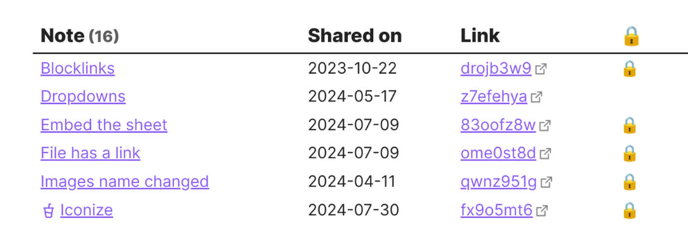

# {{ page.title }}

At some stage I plan to add a management / admin page to the plugin where you can manage
all your existing shared notes.

For now, you can achieve a fairly good management view with [Dataview](https://github.com/blacksmithgu/obsidian-dataview):



The 🔒 icon indicates that a note was shared with encryption.

## How to set up

To set it up, create a Dataview query like this in any note:

````
```dataview
TABLE WITHOUT ID
  link(file.path, truncate(file.name, 28)) as Note,
  dateformat(share_updated, "yyyy-MM-dd") as "Shared on", 
  elink(share_link, regexreplace(share_link, "^.*?(\w+)(#.+?|)$", "$1")) as Link,
  choice(regextest("#", share_link), "🔒", "") as ""
WHERE share_link
```
````

{: .warning-title }
> Important
> 
> You need to make sure to paste as plain text. If you don't know how to do that, 
change to [Source Mode](https://help.obsidian.md/Editing+and+formatting/Edit+and+preview+Markdown#Editor+modes) first before pasting.

Note titles are truncated at 28 characters. You can change that on the third line by changing the value in the `truncate` function.

To sort with your most recent shares at the top, add a `SORT` after the `WHERE` line like this:

```
WHERE share_link
SORT share_updated DESC
```
