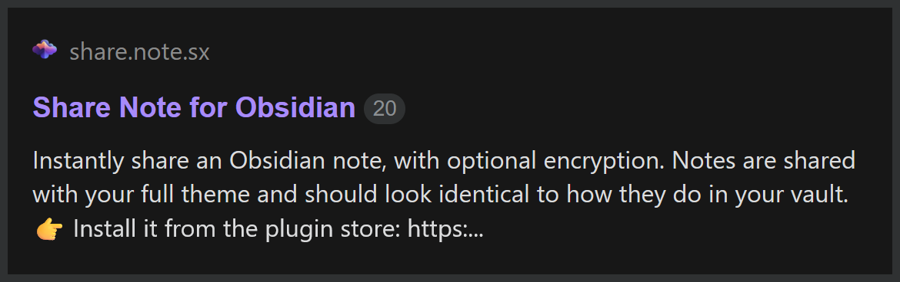

# Encryption

The content of your note is encrypted by default. What this means is that you can read the note and the person you send it to can read the note, but nobody else can read the content - not even the Share Note server.

> [!NOTE]
> Encryption is optional, and can be turned on or off for individual notes, or for all notes, whatever you prefer. See [Choosing what's encrypted](#choosing-what-s-encrypted) below.

> [!WARNING]
> Encryption applies to the note text content. It does not apply to attachments, which are stored unencrypted.
>
> Share Note is **NOT** a file sharing service, it's a **note** sharing service. If you want encrypted file sharing, it's not the right tool for you.

## How does the encryption work?

When you share an encrypted note, you'll get a share link that looks like this:

```
https://share.note.sx/xldtzcxq#Ty9bCAhVlSvC9f2FOxsUBSBW7bLAUmq0CPTObWNAdXQ
```

This part is the link to the file:

[https://share.note.sx/xldtzcxq](https://share.note.sx/xldtzcxq)

If you click on it, you'll see a message that says "*Encrypted note*", because you haven't provided the decryption key.

The decryption key is the second part of the share link after the `#` symbol:

```
Ty9bCAhVlSvC9f2FOxsUBSBW7bLAUmq0CPTObWNAdXQ
```

When you combine those two things together, the note is able to be decrypted and you can see the content:

[https://share.note.sx/xldtzcxq#Ty9bCAhVlSvC9f2FOxsUBSBW7bLAUmq0CPTObWNAdXQ](https://share.note.sx/xldtzcxq#Ty9bCAhVlSvC9f2FOxsUBSBW7bLAUmq0CPTObWNAdXQ)

The decryption key **only** exists inside your vault, and is only known to you and whoever you send the link to. Nobody else can read the content.

## Choosing what's encrypted

Before your first share, the plugin asks you to choose between **short** and **encrypted** links. Short links share the note unencrypted, so the link is just the address; encrypted links carry the key. Your answer sets [Share as encrypted by default](../settings#share-as-encrypted-by-default), and you can change it whenever you like.

To override the default for one note, add a checkbox property:

- `share_unencrypted` ticked - share this note unencrypted, even though the default is encrypted.
- `share_encrypted` ticked - encrypt this note, even though the default is unencrypted.

If a note has both ticked, `share_encrypted` wins.

Switching an already-shared note between encrypted and unencrypted changes its link, because the key is added or removed. Send the new link to anyone who had the old one.

> [!NOTE]
> **💔 The one downside of encrypted sharing**
>
> If you share your note encrypted, it can't show a preview when you paste the link into a message or forum; for example the preview which shows up in [my Obsidian forum post here](https://forum.obsidian.md/t/42788):
>
> 
