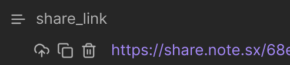

# Managing your notes

On each shared note you have a property with three icons, and a link:



- The <svg xmlns="http://www.w3.org/2000/svg" width="16" height="16" viewBox="0 0 24 24" fill="none" stroke="currentColor" stroke-width="2" stroke-linecap="round" stroke-linejoin="round" class="lucide lucide-cloud-upload"><path d="M12 13v8"/><path d="M4 14.899A7 7 0 1 1 15.71 8h1.79a4.5 4.5 0 0 1 2.5 8.242"/><path d="m8 17 4-4 4 4"/></svg> icon will re-upload the same note.
- The <svg xmlns="http://www.w3.org/2000/svg" width="16" height="16" viewBox="0 0 24 24" fill="none" stroke="currentColor" stroke-width="2" stroke-linecap="round" stroke-linejoin="round" class="lucide lucide-copy"><rect width="14" height="14" x="8" y="8" rx="2" ry="2"/><path d="M4 16c-1.1 0-2-.9-2-2V4c0-1.1.9-2 2-2h10c1.1 0 2 .9 2 2"/></svg> icon will copy the link.
- The <svg xmlns="http://www.w3.org/2000/svg" width="16" height="16" viewBox="0 0 24 24" fill="none" stroke="currentColor" stroke-width="2" stroke-linecap="round" stroke-linejoin="round" class="lucide lucide-trash-2"><path d="M3 6h18"/><path d="M19 6v14c0 1-1 2-2 2H7c-1 0-2-1-2-2V6"/><path d="M8 6V4c0-1 1-2 2-2h4c1 0 2 1 2 2v2"/><line x1="10" x2="10" y1="11" y2="17"/><line x1="14" x2="14" y1="11" y2="17"/></svg> icon will delete the shared note (but will not delete your local note!)

## Commands

The same actions are available from the command palette:

- **Share current note** - shares the note, or updates the shared page if it's already shared. The link stays the same.
- **Force re-upload of all data for this note** - shares the note and re-uploads your theme and every attachment. Use it after changing your [theme](./theme), or when a shared note doesn't look right.
- **Copy shared note link** - copies the link to your clipboard. If the note isn't shared yet, it's shared first.
- **Delete this shared note** - removes the shared page and the `share_link` and `share_updated` properties from the note, after asking you to confirm. Only listed while the current note is shared.

**Share note on the web** and **Copy shared link** are also in the `⋮` menu of every note and in the right-click menu of the file explorer.

## Making a shared notes management page

You can use a Base to create a page to view all of your previously shared notes:

```yaml
filters:
  and:
    - "!share_link.isEmpty()"
formulas:
  Shared on: share_updated.format("YYYY MMM D")
  Encrypt: if(share_link.contains("#"), "🔒", "")
  Share link: link(share_link,share_link.split("#")[0].split("/")[share_link.split("#")[0].split("/").length - 1])
  Note: link(file.path, file.name)
views:
  - type: table
    name: Table
    order:
      - formula.Shared on
      - formula.Share link
      - formula.Encrypt
      - formula.Note
    sort:
      - property: formula.Shared on
        direction: DESC
```
