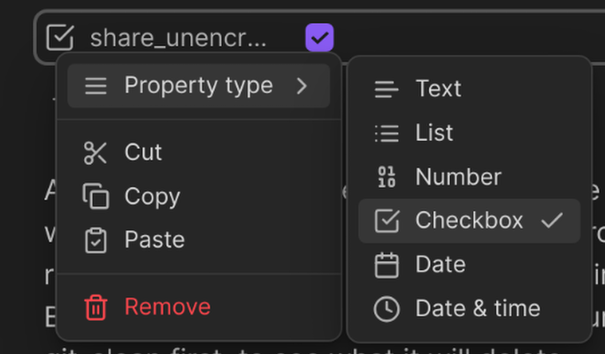

# Settings

## Share as encrypted by default

By default this is turned on - i.e. all your notes will be encrypted.

You may optionally share an unencrypted version of a note by using the frontmatter checkbox property:

```yaml
share_unencrypted: ✅
```

Make sure it's a Checkbox type:



If you turn this off, then you can encrypt an individual note by using the frontmatter property:

```yaml
share_encrypted: ✅
```

## Include Markdown source in shared notes

Off by default. When on, your shared pages get a **💾 Save note** button that lets a reader with Obsidian save a copy of the note into their own vault. The note's Markdown source is embedded in the page to make that work, which reveals things the rendered view hides. Read [Letting readers import your note](./notes/importing-shared-notes) before turning it on.

Override it for a single note with the frontmatter checkbox property:

```yaml
share_source: ✅
```

## Default note expiry

See [Self-deleting notes](./notes/self-deleting-notes).
